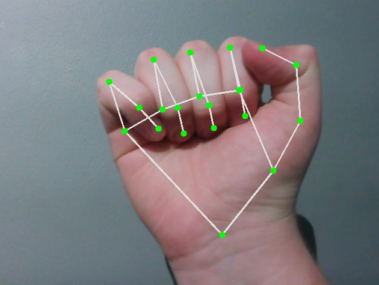
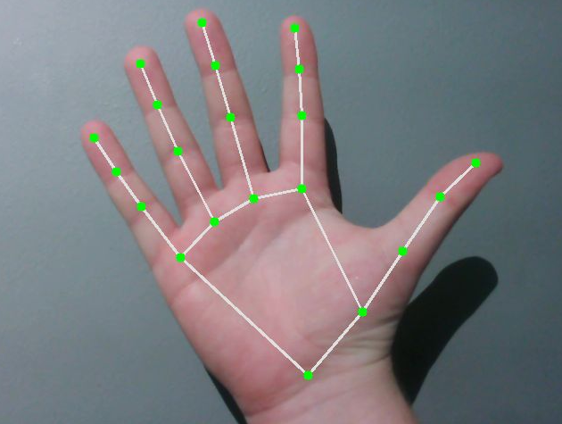
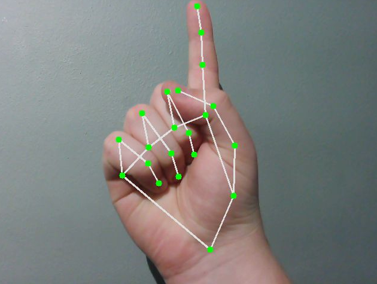
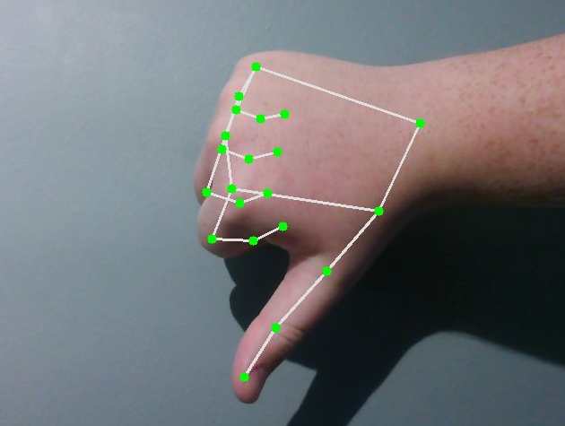
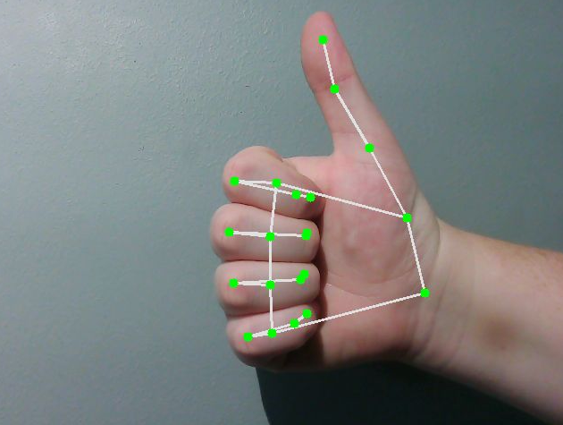
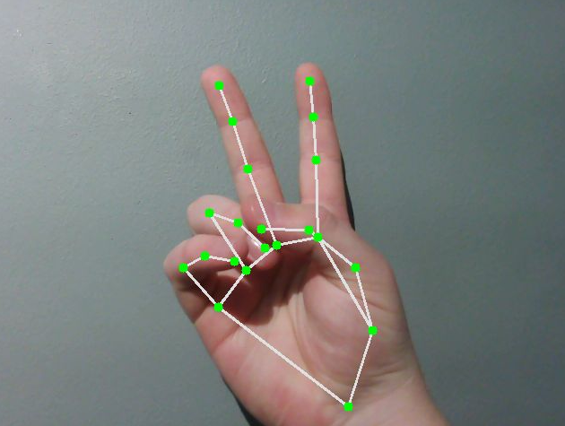
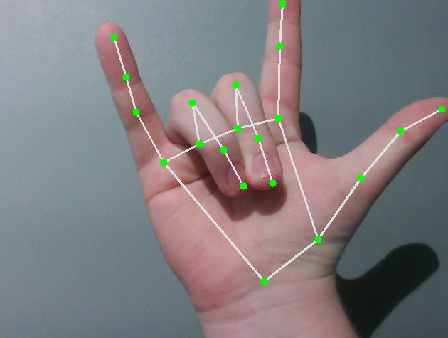
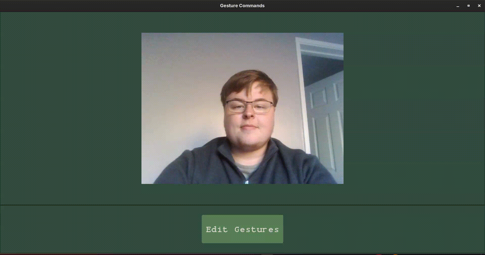
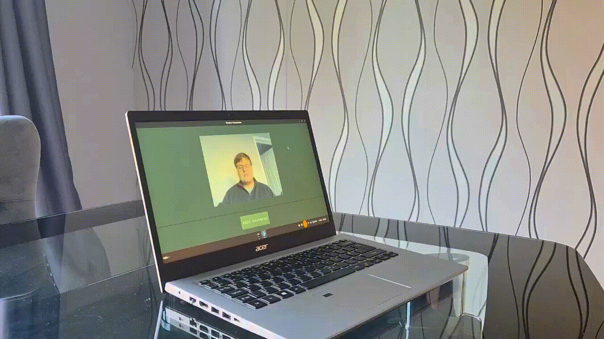
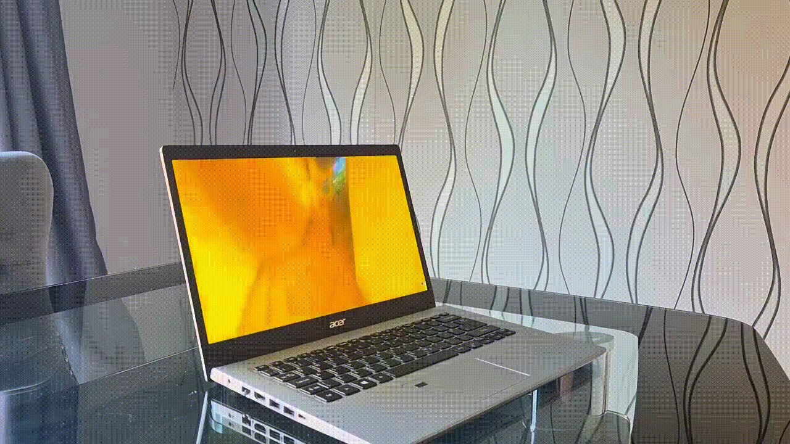

# Gesture-Commands

This project allows users to interact with a computer by performing gestures in front of a camera, which are detected and translated into commands. The project is currently designed for **Fedora Linux**, using **GLFW** and **C++** **ImGui** for the graphical interface, **Google MediaPipe** with **Python** for gesture detection, and **ZeroMQ** for communication between components.


## Getting Started

Before running the project, make sure you have a working Fedora Linux environment with access to a camera. The installation script will automatically check for the required dependencies and ensure that everything necessary for the project is installed correctly.

### Installation

1. Clone repo

 ```
git clone https://github.com/LiamUpstoneSmith/Gesture-Commands
 ```

<br>

2. Change to project directory
 ```
cd path/to/GestureCommands
 ```
<br>

3. Run the install bash script
 ```
./install.sh
 ```

<br>

4. Once the installation has completed successfully, start the application using:

 ```
./run.sh
 ```

The application will then launch the GUI and begin detecting gestures through the connected camera.

### What **install.sh** does

The script installs the **gcc** compiler, **GLFW** library, **ZeroMQ** library, python environment, and Google's **mediapipe** model.

 ```
sudo dnf install gcc-c++

sudo dnf install glfw
sudo dnf install glfw-devel

sudo dnf install zeromq zeromq-devel
sudo dnf install cppzmq-devel

python3 -m venv .venv
source .venv/bin/activate
pip install -r requirements.txt
 ```

<br>

## Supported Gestures
Current supported gestures are from Google's **Mediapipe** model. The gestures used are from American Sign Lanauge.

| Gesture     | Example |
|-------------|---------|
| Closed_Fist ||
| Open_Palm   ||
| Pointing_Up ||
| Thumb_Down  ||
| Thumb_Up    ||
| Victory     ||
| ILoveYou    ||

## Demo

### How to set a command
Allows you enter any **Fedora Linux** command that would work in your normal terminal.

(Changing the command back to "None" will cause it to note execute anything).



### Example use

1. Openeing multiple applications.
<br>


2. Pausing a video.
<br>



 ## Project structure

 - **src/gui/** holds the C++ gui files.

 - **src/model/** contains the mediapipe model. 

  ```
.
├── demo_videos
│   ├── ...
├── install.sh
├── README.md
├── requirements.txt
├── run.sh
└── src
    ├── build
    │   ├── ...
    ├── demo_app
    ├── gui
    │   ├── backends
    │   │   ├── ...
    │   ├── fonts
    │   │   └── ...
    │   ├── imgui
    │   │   ├── ...
    │   └── main.cpp
    ├── imgui.ini
    ├── Makefile
    ├── model
    │   ├── commands.json
    │   ├── gesture_recognizer.task
    │   └── model.py
    └── model-loading.png
 ```